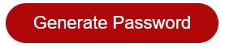
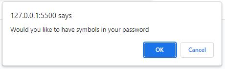
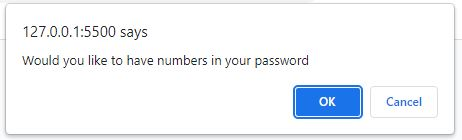

# PasswordGen-week03
Password Generator Application

Jun 27 2022

To create a password generator that accepts user input to generate a password. When the user accesses the application they will be prompted to input the following:
 
 1. the number of characters used (between 8 to 128)
 2. Choice to use lowercase letters
 3. Choice to use uppercase letters
 4. Choice to use numbers
 5. Choice to use symbols

 Following the verification of these choices a random password will be returned as long as one choice of character type has been confirmed.

 To start the generator click the generate button: 

 The generate password button will invoke serveral prompts to create a password.

 first the character count prompt.
 

 then a check for lowercase letters.
 

 Next a check for upper case letters.
 

 A check for symbols.
 

 and finally a check for numbers.
 

 Clicking OK will confirm that you would like to add the listed characters.  When a user cancels it will instead not use the character type referenced.

 The randomized password will appear in the "Your Secure Password field as seen below:

 

 Research was completed via google searches, mdn, youtube, and many many tears.

 You will find my project on Github:
 https://github.com/senseier2/PasswordGen-week03

 And a link to the generator here:
 https://senseier2.github.io/PasswordGen-week03/

 Thank you in advance for checking out my password generator.  Please feel free to contact me if you have any questions or concerns at.

 Eric.mcghee@northwestern.edu

 